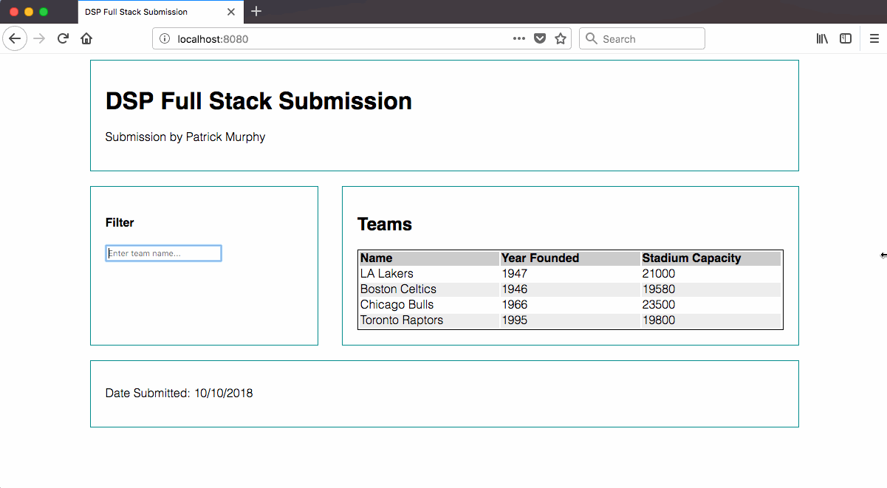

The API portion comprises of creating a new REST endpoint and the frontend portion comprises of accessing said endpoint and displaying the resulting information on a webpage.


**Note:** Please make sure to use Java 8 to complete this assignment and not Java 9.


**Note:** Both API and Frontend tasks do not rely on each other and so can be completed separately.

## API Enhancement tasks


Given the API defined in the attached zip file for managing sports teams, add the following enhancements:


1. Users should be able to create a tournament. A tournament has a name, and a list of competing teams.
 Start in `src/main/java/tournament/TournamentResource.java`

Sample request:

```POST /tournaments```
```json
{
  "name": "Basketball C",
  "teams": [{
    "id": 10001
  },
  {
    "id": 10002
  },
  {
    "id": 10003
  }],
  "fixtures": []
}
```

2. A user should be able to look up all fixtures for a given team. Each fixture has a home team and an away
team, and should be included in a team's list of fixtures if the team is in either position.
The resource is already added, implement the required query in `src/main/java/fixture/FixtureRepository.java`.

Note: If you wish to see the generated DB schema/column names from the JPA entity, or try out some queries against the database directly,
visit <http://localhost:8080/h2-console> in the browser while the sample
app is running and connect to `jdbc:h2:mem:testdb` with username `sa` and an empty password.

Sample request:

```GET /teams/10002/fixtures```

Sample response:

```json
[
    {
        "id": 1,
        "homeTeam": {
            "id": 10001,
            "name": "LA Lakers",
            "yearFounded": 1947,
            "stadiumCapacity": 21000
        },
        "awayTeam": {
            "id": 10002,
            "name": "Boston Celtics",
            "yearFounded": 1946,
            "stadiumCapacity": 19580
        },
        "week": 1,
        "tournamentId": 2
    },
    {
        "id": 5,
        "homeTeam": {
            "id": 10002,
            "name": "Boston Celtics",
            "yearFounded": 1946,
            "stadiumCapacity": 19580
        },
        "awayTeam": {
            "id": 10004,
            "name": "Toronto Raptors",
            "yearFounded": 1995,
            "stadiumCapacity": 19800
        },
        "week": 2,
        "tournamentId": 2
    },
    {
        "id": 6,
        "homeTeam": {
            "id": 10002,
            "name": "Boston Celtics",
            "yearFounded": 1946,
            "stadiumCapacity": 19580
        },
        "awayTeam": {
            "id": 10003,
            "name": "Chicago Bulls",
            "yearFounded": 1966,
            "stadiumCapacity": 23500
        },
        "week": 2,
        "tournamentId": 2
    }
]
```


3. A user should be able to hit an endpoint to create a fixture schedule for the tournament. The following rules should apply to the generated schedule:
   1. No team should be scheduled twice in the same tournament in the same week.
   2. Each team must play each other team twice, once at home, and once away.

   It should be possible to retrieve the following information once the fixtures have been generated:

   1. Find all fixtures in a given week of the tournament
   2. Find all fixtures for a given team.

**Note:** Consider using a [round robin algorithm](https://en.wikipedia.org/wiki/Round-robin_tournament#Scheduling_algorithm) to generate fixtures. One such algorithm consists of:

1. Assign each team a number.
2. If the count of teams is odd, include all teams. If the count of teams is even, include all teams
   except for the final team.
3. Generate a table such as in Figure 1 the following where the x and y axis are included team.
   * Each step down or across increases the value in the table by 1.
   * This value represents the week where these two teams play each other.
4. Look up each pair of teams in this table and a fixture for the week in which they play.
   * If a team is scheduled to play themselves in a given week:
     * If the total number of teams is odd, they should have no game that week.
     * If the total number of teams is even, they should instead play the extra team
       removed in step 2.

---

4. Generate two such sets of fixtures, one for home matches, one for away matches.
5. Group fixtures by week, then randomize which week a given set of fixtures occurs for
   so that home and away fixtures are not clumped.


Figure 1. Round Robin table

|       | 1 | 2 | 3 | 4 | 5 |
| ----- | - | - | - | - | - |
| **1** | 1 | 2 | 3 | 4 | 5 |
| **2** | 2 | 3 | 4 | 5 | 1 |
| **3** | 3 | 4 | 5 | 1 | 2 |
| **4** | 4 | 5 | 1 | 2 | 3 |
| **5** | 5 | 1 | 2 | 3 | 4 |


## Frontend Enhancement tasks

Given the Mock provided below please implement the following:

#### `src/main/webapp/index.html`
1. Please **only** edit to insert your name and date of submission, do not alter the markup.

#### `src/main/webapp/scripts/fetchTeams.js`
1. Write a JavaScript function which makes an ajax call to the _"`/teams`"_ endpoint already implemented
    1. This function should be able to call said endpoint with and without its provided query param
2. This call should fire and return all teams when; the page first loads and when the input is empty
3. When a user queries via the input the endpoint should be used to filter teams
    1. Consideration should be taken to ensure the endpoint isn't abused via the input
4. The results from any calls to the _"`/teams`"_ endpoint should be displayed in a table as shown in the mock

#### `src/main/webapp/tests/fetchTeamsTest.js`
1. Frontend tests can be added to this file (contains one test and useful info already)
2. The test runner can be found at http://localhost:8080/tests/jsunit/testRunner.html
    1. Once there simply enter "localhost:8080/tests/fetchTeamsTest.html" as the Test Page to be run

#### `src/main/webapp/css/grid.css`
1. Recreate css layout shown in the mock (doesn’t have to be pixel perfect but should have the same basic structure)
    1. Notice responsiveness also shown in mock

#### Mock


